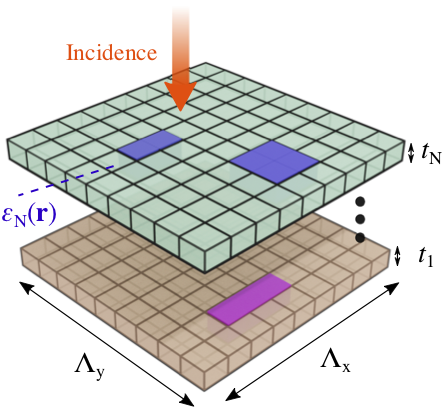

=====
grcwa
=====
.. image:: https://img.shields.io/pypi/v/grcwa.svg
        :target: https://pypi.python.org/pypi/grcwa

..
   .. image:: https://img.shields.io/travis/weiliangjinca/grcwa.svg
	   :target: https://travis-ci.org/weiliangjinca/grcwa

.. image:: https://readthedocs.org/projects/grcwa/badge/?version=latest
        :target: https://grcwa.readthedocs.io/en/latest/?badge=latest
        :alt: Documentation Status

grcwa (autoGradable RCWA) is a python implementation of rigorous
coupled wave analysis (RCWA) for arbitrarily shaped photonic crystal
slabs, supporting automatic differentation with autograd

* Free software: GPL license
* Documentation: https://grcwa.readthedocs.io.

Citing
-------

If you find **grcwa** useful for your research, please cite the
following paper:
::

   @article{Jin2020,
     title = {Inverse design of lightweight broadband reflector for relativistic lightsail propulsion},
     author ={Jin, Weiliang and Li, Wei and Orenstein, Meir and Fan, Shanhui},
     year = {2020},
     journal = {ACS Photonics},
     volume = {7},
     number = {9},
     pages = {2350--2355},
     year = {2020},
     publisher = {ACS Publications}
   }
  

Features
---------

RCWA solves EM-scattering problems of stacked photonic crystal
slabs. As illustrated in the above figure, the photonic structure can
have *N* layers of different thicknesses and independent spatial
dielectric profiles. All layers are periodic in the two lateral
directions, and invariant along the vertical direction.

* Each photonic crystal layer can have arbitrary dielectric profile on
  the *2D* grids.
* **autograd** is integrated into the package, allowing for automated
  and fast gradient evaluations for the sake of large-scale
  optimizations. Autogradable parameters include dielectric constant on
  every grid, frequency, angles, thickness of each layer, and
  periodicity (however the ratio of periodicity along the two lateral
  directions must be fixed).

Quick Start
-----------
* Installation:

  .. code-block:: console
		  
		  $ pip install grcwa

  Or,

  .. code-block:: console

		  $ git clone git://github.com/weiliangjinca/grcwa
		  $ pip install .

* Example 1: transmission and reflection (sum or by order) of a square lattice of a hole: `ex1.py <./example/ex1.py>`_

* Example 2: Transmission and reflection of two patterned layers: `ex2.py <./example/ex2.py>`_, as illustrated in the figure below (only a **unit cell** is plotted)

  .. image:: imag/ex.png
	     
  * *Periodicity* in the lateral direction is  *L*\ :sub:`x` = *L*\ :sub:`y` = 0.2, and *frequency* is 1.0.

  * The incident light has an angel *pi*/10.

    .. code-block:: python
		  
		    import grcwa
		    import numpy as np
		    grcwa.set_backend('autograd') # if autograd needed
		    
		     # lattice constants
		     L1 = [0.2,0]
		     L2 = [0,0.2]
		     # Truncation order (actual number might be smaller)
		     nG = 101
		     # frequency
		     freq = 1.
		     # angle
		     theta = np.pi/10
		     phi = 0.

		     # setup RCWA
		     obj = grcwa.obj(nG,L1,L2,freq,theta,phi,verbose=1)		    

  * Geometry: the thicknesses of the four layers are 0.1,0.2,0.3, and 0.4. For patterned layers, we consider total grid points *N*\ :sub:`x` \* *N*\ :sub:`y` = 100\*100 within the unit cell.
    
  * Dielectric constant: 2.0 for the 0-th layer; 4.0 (1.0) for the 1st layer in the orange (void) region; 6.0 (1.0) for the 2nd layer in the bule (void) region; and 3.0 for the last layer.

    .. code-block:: python

		    Np = 2 # number of patterned layers
		    Nx = 100
		    Ny = 100
		    
		    thick0 = 0.1
		    pthick = [0.2,0.3]
		    thickN = 0.4

		    ep0 = 2.
		    epN = 3.
		    
		    obj.Add_LayerUniform(thick0,ep0)
		    for i in range(Np):
		        obj.Add_LayerGrid(pthick[i],Nx,Ny)
		    obj.Add_LayerUniform(thickN,epN)

		    obj.Init_Setup()

  * Patterned layer: the 1-th layer a circular hole of radius 0.5 *L*\ :sub:`x`, and the 2-nd layer has a square hole of 0.5 *L*\ :sub:`x`
  
    .. code-block:: python

		    radius = 0.5
		    a = 0.5

		    ep1 = 4.
		    ep2 = 6.
		    epbkg = 1.

		    # coordinate
		    x0 = np.linspace(0,1.,Nx)
		    y0 = np.linspace(0,1.,Ny)
		    x, y = np.meshgrid(x0,y0,indexing='ij')

		    # layer 1
		    epgrid1 = np.ones((Nx,Ny))*ep1
		    ind = (x-.5)**2+(y-.5)**2<radius**2
		    epgrid1[ind]=epbkg

		    # layer 2
		    epgrid2 = np.ones((Nx,Ny))*ep2
		    ind = np.logical_and(np.abs(x-.5)<a/2 and np.abs(y-.5)<a/2))
		    epgrid2[ind]=epbkg		    
		    
		    # combine epsilon of all layers
		    epgrid = np.concatenate((epgrid1.flatten(),epgrid2.flatten()))
		    obj.GridLayer_geteps(epgrid)

  * Incident light is *s*-polarized

    .. code-block:: python

		     planewave={'p_amp':0,'s_amp':1,'p_phase':0,'s_phase':0}
		     obj.MakeExcitationPlanewave(planewave['p_amp'],planewave['p_phase'],planewave['s_amp'],planewave['s_phase'],order = 0)

		     # solve for R and T
		     R,T= obj.RT_Solve(normalize=1)

* Example 3: topology optimization of reflection of a single patterned layer, `ex3.py <./example/ex3.py>`_

* Example 4: transmission and reflection (sum or by order) of a hexagonal lattice of a hole: `ex4.py <./example/ex4.py>`_
  
Note on conventions
-------------------

* The vacuum permittivity, permeability, and speed of light are *1*.
* The time harmonic convention is *exp(-i omega t)*.

Acknowledgements
----------------

My implementation of RCWA received helpful discussions from `Dr. Zin
Lin
<https://scholar.google.com/citations?user=3ZgzHLYAAAAJ&hl=en>`_. Many
details of implementations were referred to a RCWA package implemented
in c called `S4 <https://github.com/victorliu/S4>`_. The idea of
integrating **Autograd** into RCWA package rather than deriving
adjoint-variable gradient by hand was inspired by a discussion with
Dr. Ian Williamson and Dr. Momchil Minkov. The backend and many other
styles follow their implementation in `legume
<https://github.com/fancompute/legume>`_. Haiwen Wang and Cheng Guo
provided useful feedback. Lastly, the template was credited to
Cookiecutter_ and the `audreyr/cookiecutter-pypackage`_.

.. _Cookiecutter: https://github.com/audreyr/cookiecutter
.. _`audreyr/cookiecutter-pypackage`: https://github.com/audreyr/cookiecutter-pypackage
